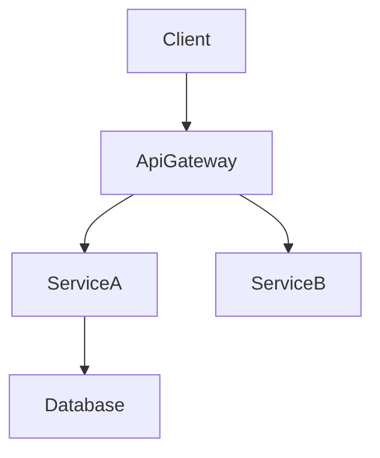

# 技术设计规则和原则

## 核心设计原则

### 1. 类型安全是强制性的
- **绝不**在TypeScript接口中使用 `any` 类型
- 为所有参数和返回值定义显式类型
- 使用判别联合类型进行错误处理
- 明确指定泛型约束

### 2. 设计与实现
- **关注WHAT（做什么），而非HOW（如何做）**
- 定义接口和契约，而非代码
- 通过前置/后置条件指定行为
- 记录架构决策，而非算法

### 3. 可视化沟通
- **简单功能**：基本组件图或无图
- **中等复杂度**：架构 + 数据流
- **高复杂度**：多个图表（架构、序列、状态）
- **始终使用纯Mermaid**：无样式，仅结构

### 4. 组件设计规则
- **单一职责**：每个组件一个明确目的
- **清晰边界**：明确的领域所有权
- **依赖方向**：遵循架构层次
- **接口隔离**：最小化、聚焦的接口
- **团队安全接口**：设计允许并行实现且无合并冲突的边界
- **调研可追溯性**：在 `research.md` 中记录边界决策和理由

### 5. 数据建模标准
- **领域优先**：从业务概念开始
- **一致性边界**：清晰的聚合根
- **规范化**：在性能和完整性之间平衡
- **演进**：规划模式变更

### 6. 错误处理理念
- **快速失败**：尽早且清晰地验证
- **优雅降级**：部分功能优于完全失败
- **用户上下文**：可操作的错误消息
- **可观测性**：全面的日志记录和监控

### 7. 集成模式
- **松耦合**：最小化依赖
- **契约优先**：在实现之前定义接口
- **版本控制**：规划API演进
- **幂等性**：设计重试安全
- **契约可见性**：在design.md中展示API和事件契约，同时链接 `research.md` 中的扩展详情

## 文档标准

### 语言和语调
- **声明式**："系统对用户进行身份验证"而非"系统应该进行身份验证"
- **精确**：使用特定技术术语而非模糊描述
- **简洁**：仅包含必要信息
- **正式**：专业的技术写作

### 结构要求
- **层次化**：清晰的章节组织
- **可追溯**：需求到组件的映射
- **完整**：涵盖实现的所有方面
- **一致**：统一的术语
- **聚焦**：保持design.md专注于架构和契约；将调查日志和冗长比较移至 `research.md`

## Section Authoring Guidance

### 全局顺序
- 默认流程：概述 → 目标/非目标 → 需求可追溯性 → 架构 → 技术栈 → 系统流程 → 组件和接口 → 数据模型 → 可选章节。
- 团队可以在提高清晰度时提前交换可追溯性或将数据模型靠近架构，但保持章节标题不变。
- 在每个章节内，遵循 **摘要 → 范围 → 决策 → 影响/风险**，以便评审者能够一致地扫描。

### 需求ID
- Reference requirements as `2.1, 2.3` without prefixes (no “Requirement 2.1”).
- All requirements MUST have numeric IDs. If a requirement lacks a numeric ID, stop and fix `requirements.md` before continuing.
- Use `N.M`-style numeric IDs where `N` is the top-level requirement number from requirements.md (for example, Requirement 1 → 1.1, 1.2; Requirement 2 → 2.1, 2.2).
- Every component, task, and traceability row must reference the same canonical numeric ID.

### 技术栈
- Include ONLY layers impacted by this feature (frontend, backend, data, messaging, infra).
- For each layer specify tool/library + version + the role it plays; push extended rationale, comparisons, or benchmarks to `research.md`.
- When extending an existing system, highlight deviations from the current stack and list new dependencies.

### 系统流程
- Add diagrams only when they clarify behavior:  
  - **Sequence** for multi-step interactions  
  - **Process/State** for branching rules or lifecycle  
  - **Data/Event** for pipelines or async patterns
- Always use pure Mermaid. If no complex flow exists, omit the entire section.

### 需求可追溯性
- Use the standard table (`Requirement | Summary | Components | Interfaces | Flows`) to prove coverage.
- Collapse to bullet form only when a single requirement maps 1:1 to a component.
- Prefer the component summary table for simple mappings; reserve the full traceability table for complex or compliance-sensitive requirements.
- Re-run this mapping whenever requirements or components change to avoid drift.

### 组件和接口编写
- 按领域/层对组件进行分组，每个组件提供一个块。
- 从列出组件、领域、意图、需求覆盖、关键依赖和选定契约的摘要表开始。
- 表格字段：意图（一行）、需求（`2.1, 2.3`）、所有者/评审者（可选）。
- 依赖项表必须将每个条目标记为入站/出站/外部，并分配关键性（`P0` 阻塞、`P1` 高风险、`P2` 信息性）。
- 外部依赖调研的摘要保留在此处；详细调查（API签名、速率限制、迁移说明）属于 `research.md`。
- design.md必须保持为自包含的评审工件。仅在背景中引用 `research.md`，并在此处重述任何结论或决策。
- 契约：仅勾选相关类型（Service/API/Event/Batch/State）。未选中的类型不应在组件章节的后续部分出现。
- 服务接口必须声明方法签名、输入/输出和错误信封。API/Event/Batch契约需要涵盖触发器、负载、交付、幂等性的模式表或项目符号列表。
- 使用 **集成和迁移说明**、**验证钩子**和 **开放问题/风险** 来记录推出策略、可观测性和未解决的决策。
- 详细密度规则：
  - **完整块**：引入新边界的组件（逻辑钩子、共享服务、外部集成、数据层）。
  - **仅摘要**：没有新边界的展示/UI组件（如果需要，加上简短的实现说明）。
- 实现说明必须将集成/验证/风险合并到单个项目符号子章节中，以减少重复。
- 对于短数据（依赖项、契约选择），优先使用列表或内联描述符。仅在比较多个项目时使用表格。

### Shared Interfaces & Props
- Define a base interface (e.g., `BaseUIPanelProps`) for recurring UI components and extend it per component to capture only the deltas.
- Hooks, utilities, and integration adapters that introduce new contracts should still include full TypeScript signatures.
- When reusing a base contract, reference it explicitly (e.g., “Extends `BaseUIPanelProps` with `onSubmitAnswer` callback”) instead of duplicating the code block.

### Data Models
- Domain Model covers aggregates, entities, value objects, domain events, and invariants. Add Mermaid diagrams only when relationships are non-trivial.
- Logical Data Model should articulate structure, indexing, sharding, and storage-specific considerations (event store, KV/wide-column) relevant to the change.
- Data Contracts & Integration section documents API payloads, event schemas, and cross-service synchronization patterns when the feature crosses boundaries.
- Lengthy type definitions or vendor-specific option objects should be placed in the Supporting References section within design.md, linked from the relevant section. Investigation notes stay in `research.md`.
- Supporting References usage is optional; only create it when keeping the content in the main body would reduce readability. All decisions must still appear in the main sections so design.md stands alone.

### Error/Testing/Security/Performance Sections
- Record only feature-specific decisions or deviations. Link or reference organization-wide standards (steering) for baseline practices instead of restating them.

### Diagram & Text Deduplication
- Do not restate diagram content verbatim in prose. Use the text to highlight key decisions, trade-offs, or impacts that are not obvious from the visual.
- When a decision is fully captured in the diagram annotations, a short “Key Decisions” bullet is sufficient.

### General Deduplication
- Avoid repeating the same information across Overview, Architecture, and Components. Reference earlier sections when context is identical.
- If a requirement/component relationship is captured in the summary table, do not rewrite it elsewhere unless extra nuance is added.

## 图表指南

### 何时包含图表
- **架构**：当3个或更多组件或外部系统交互时使用结构图。
- **序列**：当调用/握手跨越多个步骤时绘制序列图。
- **状态/流程**：在专用图表中捕获复杂的状态机或业务流。
- **ER**：为非平凡数据模型提供实体关系图。
- **跳过**：小的单组件更改通常不需要图表。

### Mermaid要求

- **仅纯Mermaid** – 避免自定义样式或不支持的语法。
- **节点ID** – 仅字母数字加下划线（例如，`Client`、`ServiceA`）。不要使用 `@`、`/` 或前导 `-`。
- **标签** – 简单单词。不要嵌入括号 `()`、方括号 `[]`、引号 `"` 或斜杠 `/`。
  - ❌ `DnD[@dnd-kit/core]` → 无效ID（`@`）。
  - ❌ `UI[KanbanBoard(React)]` → 无效标签（`()`）。
  - ✅ `DndKit[dnd-kit core]` → 在标签中使用纯文本，将技术细节保留在随附的描述中。
  - ℹ️ Mermaid严格模式否则会失败，错误如 `Expecting 'SQE' ... got 'PS'`；在渲染前从标签中删除标点符号。
- **边** – 显示数据或控制流方向。
- **组** – 允许使用Mermaid子图来聚类相关组件；为清晰起见，请谨慎使用。

## 质量指标
### 设计完整性检查清单
- 所有需求已解决
- 无实现细节泄露
- 清晰的组件边界
- 显式错误处理
- 全面的测试策略
- 已考虑安全性
- 已定义性能目标
- 迁移路径清晰（如适用）

### 要避免的常见反模式
❌ 将设计与实现混合
❌ 模糊的接口定义
❌ 缺少错误场景
❌ 忽略非功能需求
❌ 过度复杂的架构
❌ 组件之间的紧密耦合
❌ 缺少数据一致性策略
❌ 不完整的依赖分析
