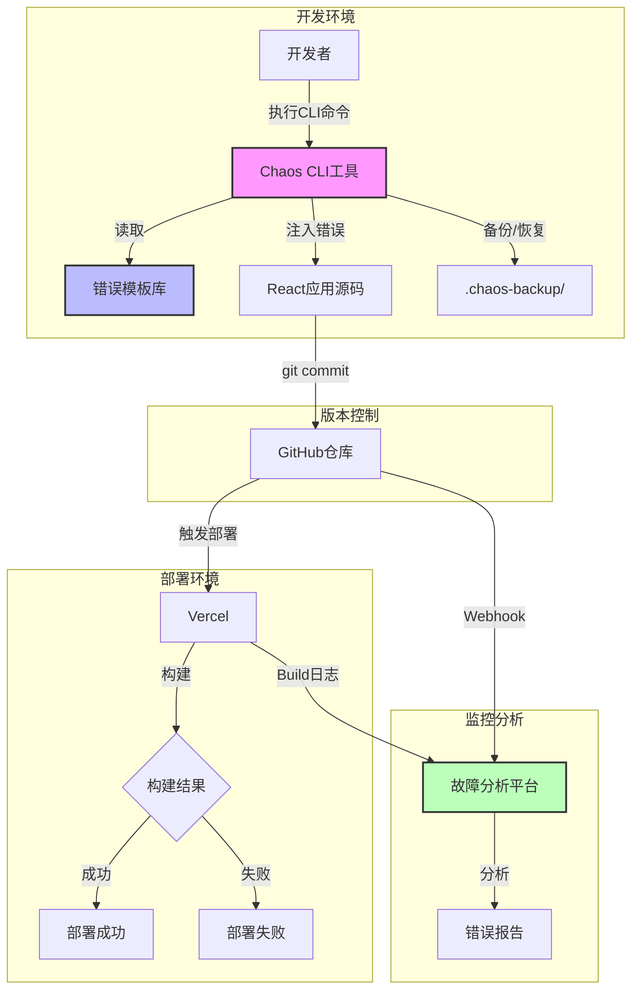
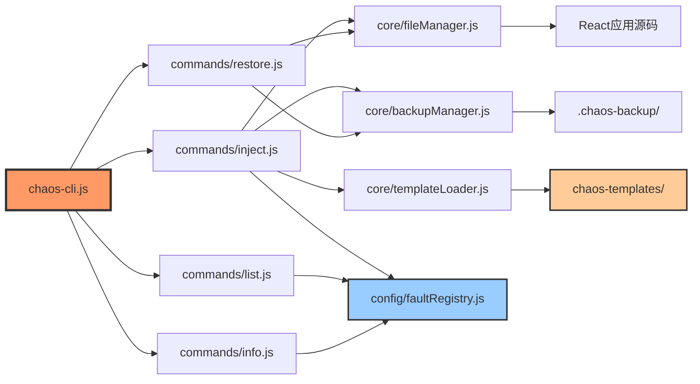
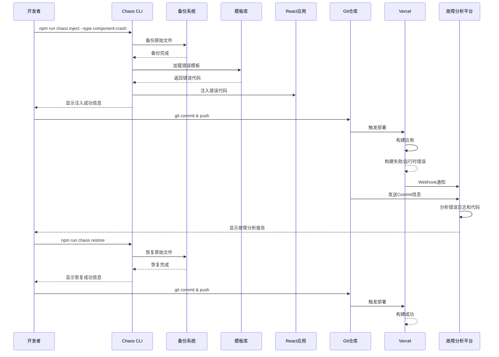

# DESIGN - React混沌工程演练

## 📐 整体架构图



---

## 🏗️ 分层设计和核心组件

### 1. React应用层（Demo Application）

#### 1.1 应用结构
```
src/
├── main.jsx                 # Vite入口文件
├── App.jsx                  # 应用根组件
├── components/              # 可复用组件
│   ├── Layout/
│   │   ├── Header.jsx       # 顶部导航
│   │   ├── Footer.jsx       # 底部信息
│   │   └── Sidebar.jsx      # 侧边栏（可选）
│   ├── common/
│   │   ├── Button.jsx       # 按钮组件
│   │   ├── Card.jsx         # 卡片组件
│   │   ├── Loading.jsx      # 加载组件
│   │   └── ErrorBoundary.jsx # 错误边界
│   └── features/
│       ├── TaskCard.jsx     # 任务卡片
│       ├── TaskList.jsx     # 任务列表
│       └── TaskForm.jsx     # 任务表单
├── pages/
│   ├── Home.jsx             # 首页
│   ├── TaskList.jsx         # 任务列表页
│   ├── TaskDetail.jsx       # 任务详情页
│   └── About.jsx            # 关于页面
├── hooks/
│   ├── useTasks.js          # 任务数据Hook
│   ├── useAsync.js          # 异步处理Hook
│   └── useLocalStorage.js   # 本地存储Hook
├── utils/
│   ├── mockApi.js           # Mock API
│   ├── helpers.js           # 工具函数
│   └── constants.js         # 常量定义
├── context/
│   └── TaskContext.jsx      # 任务状态Context
└── styles/
    └── index.css            # 全局样式（TailwindCSS）
```

#### 1.2 核心组件设计

**App.jsx - 应用根组件**
```javascript
/**
 * 应用根组件
 * - 配置路由
 * - 提供全局Context
 * - 错误边界包裹
 */
```

**ErrorBoundary.jsx - 错误边界**
```javascript
/**
 * 错误边界组件
 * - 捕获子组件错误
 * - 展示友好的错误信息
 * - 提供错误恢复选项
 */
```

**TaskContext.jsx - 状态管理**
```javascript
/**
 * 任务状态管理
 * - 任务列表状态
 * - CRUD操作方法
 * - 加载状态管理
 */
```

### 2. CLI工具层（Chaos Engineering CLI）

#### 2.1 CLI结构
```
scripts/
├── chaos-cli.js             # CLI主入口
├── commands/
│   ├── inject.js            # 故障注入命令
│   ├── restore.js           # 恢复命令
│   ├── list.js              # 列表命令
│   └── info.js              # 信息命令
├── core/
│   ├── fileManager.js       # 文件操作管理
│   ├── backupManager.js     # 备份管理
│   ├── templateLoader.js    # 模板加载器
│   └── logger.js            # 日志输出
└── config/
    └── faultRegistry.js     # 故障类型注册表
```

#### 2.2 核心模块设计

**chaos-cli.js - CLI主程序**
```javascript
/**
 * CLI主程序
 * - 解析命令行参数
 * - 路由到对应的命令处理器
 * - 统一错误处理
 */
const commands = {
  inject: require('./commands/inject'),
  restore: require('./commands/restore'),
  list: require('./commands/list'),
  info: require('./commands/info')
};
```

**inject.js - 故障注入**
```javascript
/**
 * 故障注入核心逻辑
 * 1. 验证故障类型是否存在
 * 2. 备份目标文件
 * 3. 加载错误模板
 * 4. 注入错误代码
 * 5. 输出操作结果
 */
async function injectFault(faultType) {
  // 1. 验证
  const faultConfig = getFaultConfig(faultType);
  
  // 2. 备份
  await backupFiles(faultConfig.targetFiles);
  
  // 3. 加载模板
  const template = loadTemplate(faultType);
  
  // 4. 注入
  await applyTemplate(template, faultConfig.targetFiles);
  
  // 5. 输出
  logSuccess(faultType, faultConfig);
}
```

**restore.js - 恢复正常**
```javascript
/**
 * 恢复正常状态
 * 1. 检查备份是否存在
 * 2. 恢复所有备份文件
 * 3. 清理备份目录
 * 4. 输出操作结果
 */
async function restore() {
  // 1. 检查备份
  const backupExists = checkBackup();
  
  // 2. 恢复文件
  await restoreFromBackup();
  
  // 3. 清理
  await cleanBackup();
  
  // 4. 输出
  logSuccess('restore');
}
```

**faultRegistry.js - 故障注册表**
```javascript
/**
 * 故障类型注册表
 * 定义所有支持的故障类型及其配置
 */
module.exports = {
  'syntax-error': {
    name: '语法错误',
    category: 'build-errors',
    targetFiles: ['src/pages/Home.jsx'],
    description: 'JSX语法错误，缺少闭合标签',
    expectedError: 'Unexpected token'
  },
  'component-crash': {
    name: '组件崩溃',
    category: 'runtime-errors',
    targetFiles: ['src/components/features/TaskCard.jsx'],
    description: '访问undefined属性导致组件崩溃',
    expectedError: 'Cannot read property of undefined'
  },
  // ... 其他故障类型
};
```

### 3. 错误模板层（Fault Templates）

#### 3.1 模板库结构
```
chaos-templates/
├── build-errors/
│   ├── syntax-error.template.jsx
│   ├── import-error.template.jsx
│   ├── dependency-missing.template.json
│   └── env-missing.template.js
├── runtime-errors/
│   ├── component-crash.template.jsx
│   ├── infinite-loop.template.jsx
│   ├── state-error.template.jsx
│   ├── route-error.template.jsx
│   └── api-timeout.template.js
├── resource-errors/
│   ├── image-404.template.jsx
│   └── chunk-load-fail.template.jsx
├── performance-issues/
│   ├── memory-leak.template.jsx
│   └── slow-render.template.jsx
└── README.md
```

#### 3.2 模板格式设计

每个模板文件包含：
1. **错误代码**：真实的React错误代码
2. **元数据注释**：故障类型、描述、预期错误

**示例：component-crash.template.jsx**
```javascript
/**
 * @fault-type: component-crash
 * @category: runtime-errors
 * @description: 组件崩溃 - 访问undefined属性
 * @expected-error: Cannot read property 'title' of undefined
 * @target-file: src/components/features/TaskCard.jsx
 */

import React from 'react';

function TaskCard({ task }) {
  // 🚨 错误：task可能为undefined
  return (
    <div className="task-card">
      <h3>{task.title}</h3>
      <p>{task.description}</p>
    </div>
  );
}

export default TaskCard;
```

### 4. 备份恢复层（Backup System）

#### 4.1 备份目录结构
```
.chaos-backup/
├── metadata.json            # 备份元数据
├── timestamp/               # 时间戳目录
│   ├── src/
│   │   └── components/
│   │       └── TaskCard.jsx
│   └── package.json
└── .gitkeep
```

#### 4.2 备份元数据格式
```json
{
  "timestamp": "2026-01-14T10:30:00.000Z",
  "faultType": "component-crash",
  "backedUpFiles": [
    "src/components/features/TaskCard.jsx"
  ],
  "originalHashes": {
    "src/components/features/TaskCard.jsx": "abc123..."
  }
}
```

---

## 🔄 模块依赖关系图



---

## 📡 接口契约定义

### 1. CLI命令接口

#### inject命令
```bash
npm run chaos inject --type <fault-type>

# 参数:
#   --type: 故障类型 (必需)
# 
# 返回:
#   成功: exit code 0, 输出注入信息
#   失败: exit code 1, 输出错误信息
```

#### restore命令
```bash
npm run chaos restore

# 参数: 无
# 
# 返回:
#   成功: exit code 0, 输出恢复信息
#   失败: exit code 1, 输出错误信息
```

#### list命令
```bash
npm run chaos list [--category <category>]

# 参数:
#   --category: 故障类别 (可选)
# 
# 输出: 故障类型列表（表格格式）
```

#### info命令
```bash
npm run chaos info --type <fault-type>

# 参数:
#   --type: 故障类型 (必需)
# 
# 输出: 故障详细信息
```

### 2. 模板加载器接口

```javascript
/**
 * 加载错误模板
 * @param {string} faultType - 故障类型
 * @returns {Object} 模板对象
 */
function loadTemplate(faultType) {
  return {
    code: '...',           // 错误代码
    targetFile: '...',     // 目标文件路径
    metadata: {            // 元数据
      description: '...',
      expectedError: '...'
    }
  };
}
```

### 3. 文件管理器接口

```javascript
/**
 * 读取文件内容
 * @param {string} filePath - 文件路径
 * @returns {Promise<string>} 文件内容
 */
async function readFile(filePath);

/**
 * 写入文件内容
 * @param {string} filePath - 文件路径
 * @param {string} content - 文件内容
 * @returns {Promise<void>}
 */
async function writeFile(filePath, content);

/**
 * 复制文件
 * @param {string} source - 源文件路径
 * @param {string} dest - 目标文件路径
 * @returns {Promise<void>}
 */
async function copyFile(source, dest);
```

### 4. 备份管理器接口

```javascript
/**
 * 创建备份
 * @param {string[]} filePaths - 需要备份的文件列表
 * @param {string} faultType - 故障类型
 * @returns {Promise<string>} 备份ID
 */
async function createBackup(filePaths, faultType);

/**
 * 恢复备份
 * @param {string} backupId - 备份ID（可选，默认最新）
 * @returns {Promise<void>}
 */
async function restoreBackup(backupId);

/**
 * 检查备份是否存在
 * @returns {boolean} 是否存在备份
 */
function hasBackup();
```

---

## 🌊 数据流向图



---

## ⚠️ 异常处理策略

### 1. CLI工具异常处理

#### 用户输入错误
```javascript
// 故障类型不存在
if (!faultRegistry[faultType]) {
  console.error(`❌ 错误：故障类型 "${faultType}" 不存在`);
  console.log(`💡 使用 "npm run chaos list" 查看所有可用的故障类型`);
  process.exit(1);
}
```

#### 备份不存在
```javascript
// 恢复时备份不存在
if (!hasBackup()) {
  console.error(`❌ 错误：未找到备份文件`);
  console.log(`💡 请先执行 "npm run chaos inject" 注入故障`);
  process.exit(1);
}
```

#### 文件操作失败
```javascript
// 文件读写错误
try {
  await writeFile(targetFile, content);
} catch (error) {
  console.error(`❌ 错误：无法写入文件 ${targetFile}`);
  console.error(`详细信息：${error.message}`);
  // 尝试恢复备份
  await restoreBackup();
  process.exit(1);
}
```

### 2. React应用异常处理

#### 错误边界
```javascript
// ErrorBoundary组件捕获子组件错误
class ErrorBoundary extends React.Component {
  componentDidCatch(error, errorInfo) {
    // 记录错误信息
    console.error('组件错误:', error, errorInfo);
    
    // 更新状态显示错误UI
    this.setState({ hasError: true, error });
  }
}
```

#### 异步错误处理
```javascript
// API调用错误处理
async function fetchTasks() {
  try {
    const data = await mockApi.getTasks();
    return data;
  } catch (error) {
    console.error('获取任务失败:', error);
    // 显示错误提示
    showErrorToast('加载失败，请稍后重试');
    return [];
  }
}
```

### 3. 构建错误处理

#### Vite构建错误
```javascript
// vite.config.js
export default {
  build: {
    rollupOptions: {
      onwarn(warning, warn) {
        // 忽略某些警告
        if (warning.code === 'UNUSED_EXTERNAL_IMPORT') return;
        warn(warning);
      }
    }
  }
}
```

---

## 🔐 安全考虑

### 1. 备份文件保护
- `.chaos-backup/` 添加到 `.gitignore`
- 防止备份文件被提交到仓库
- 定期清理过期备份

### 2. 模板代码安全
- 模板代码不包含恶意代码
- 只修改指定的目标文件
- 不修改Git配置或系统文件

### 3. 环境变量保护
- 敏感信息使用 `.env` 文件
- `.env` 添加到 `.gitignore`
- 提供 `.env.example` 示例文件

---

## 📊 性能优化策略

### 1. CLI工具性能
- 使用流式读写大文件
- 并行备份多个文件
- 缓存模板加载结果

### 2. React应用性能
- 使用React.memo优化组件渲染
- 虚拟滚动处理大列表
- 代码分割（React.lazy）
- 图片懒加载

### 3. 构建性能
- Vite快速冷启动
- HMR热模块替换
- 生产构建优化（Tree-shaking、压缩）

---

## 🎨 UI/UX设计原则

### 1. CLI输出设计
- 使用颜色区分信息类型（成功/错误/警告）
- 使用表格格式展示列表
- 提供清晰的操作提示
- 显示进度指示器

### 2. React应用UI
- 简洁现代的卡片式布局
- 响应式设计（支持移动端）
- 友好的错误提示
- 加载状态指示

### 3. 错误展示
- 清晰的错误信息
- 提供错误堆栈（开发模式）
- 友好的错误页面
- 错误恢复建议

---

## 📦 部署配置

### Vercel配置
```json
{
  "version": 2,
  "builds": [
    {
      "src": "package.json",
      "use": "@vercel/static-build",
      "config": {
        "distDir": "dist"
      }
    }
  ],
  "routes": [
    {
      "src": "/(.*)",
      "dest": "/index.html"
    }
  ]
}
```

### 环境变量
```bash
# .env.example
VITE_APP_NAME=Chaos Engineering Demo
VITE_API_BASE_URL=/api
```

---

## ✅ 设计验证清单

- [x] 架构图清晰完整
- [x] 模块职责明确
- [x] 接口定义完整
- [x] 数据流向清晰
- [x] 异常处理完善
- [x] 安全考虑充分
- [x] 性能优化合理
- [x] 与现有系统无冲突

**设计阶段完成，准备进入Atomize阶段。**

