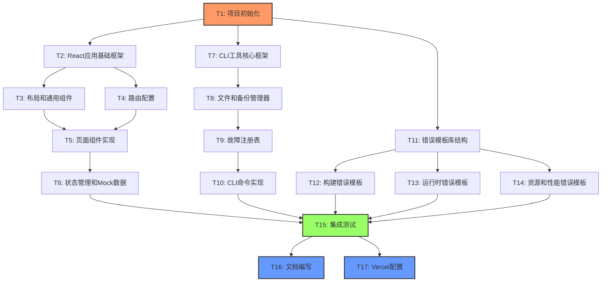

# TASK - React混沌工程演练任务拆分

## 📋 任务依赖关系图

---

## 🎯 任务列表

### T1: 项目初始化和环境配置

**输入契约**：
- 前置依赖：无
- 输入数据：现有的package.json
- 环境依赖：Node.js >= 16.x, npm

**输出契约**：
- 输出数据：
  - 初始化的Vite + React项目
  - 配置好的package.json（包含所有依赖和scripts）
  - TailwindCSS配置
  - .gitignore配置
  - 基础目录结构
- 交付物：
  - `package.json`
  - `vite.config.js`
  - `tailwind.config.js`
  - `postcss.config.js`
  - `.gitignore`
  - 基础src目录结构
- 验收标准：
  - `npm install` 成功执行
  - `npm run dev` 可以启动开发服务器
  - TailwindCSS样式生效

**实现约束**：
- 技术栈：Vite 5.x, React 18.x, TailwindCSS 3.x
- 接口规范：标准的Vite项目结构
- 质量要求：依赖版本明确，无安全漏洞

**依赖关系**：
- 后置任务：T2, T7, T11
- 并行任务：无

---

### T2: React应用基础框架

**输入契约**：
- 前置依赖：T1完成
- 输入数据：初始化的项目结构
- 环境依赖：开发服务器可运行

**输出契约**：
- 输出数据：
  - App.jsx根组件
  - main.jsx入口文件
  - ErrorBoundary组件
  - 全局样式配置
- 交付物：
  - `src/App.jsx`
  - `src/main.jsx`
  - `src/components/common/ErrorBoundary.jsx`
  - `src/styles/index.css`
- 验收标准：
  - 应用可以正常渲染
  - ErrorBoundary可以捕获错误
  - TailwindCSS样式正常工作

**实现约束**：
- 技术栈：React 18, JSX
- 接口规范：标准的React组件
- 质量要求：代码遵循前端规范，有JSDoc注释

**依赖关系**：
- 前置任务：T1
- 后置任务：T3, T4
- 并行任务：T7, T11

---

### T3: 布局和通用组件

**输入契约**：
- 前置依赖：T2完成
- 输入数据：App.jsx根组件
- 环境依赖：React开发环境

**输出契约**：
- 输出数据：
  - Header组件（导航栏）
  - Footer组件（底部信息）
  - Button组件（按钮）
  - Card组件（卡片）
  - Loading组件（加载指示器）
- 交付物：
  - `src/components/Layout/Header.jsx`
  - `src/components/Layout/Footer.jsx`
  - `src/components/common/Button.jsx`
  - `src/components/common/Card.jsx`
  - `src/components/common/Loading.jsx`
- 验收标准：
  - 所有组件可以独立渲染
  - 样式美观，响应式设计
  - 组件有PropTypes或注释说明

**实现约束**：
- 技术栈：React, TailwindCSS
- 接口规范：可复用的函数组件
- 质量要求：组件解耦，易于维护

**依赖关系**：
- 前置任务：T2
- 后置任务：T5
- 并行任务：T4

---

### T4: 路由配置

**输入契约**：
- 前置依赖：T2完成
- 输入数据：App.jsx根组件
- 环境依赖：React Router依赖已安装

**输出契约**：
- 输出数据：
  - 路由配置
  - 404页面
  - 路由导航组件
- 交付物：
  - 更新的`src/App.jsx`（包含路由配置）
  - `src/pages/NotFound.jsx`（404页面）
- 验收标准：
  - 路由可以正常切换
  - 404页面正常显示
  - 浏览器前进后退正常工作

**实现约束**：
- 技术栈：React Router v6
- 接口规范：标准的React Router配置
- 质量要求：路由结构清晰

**依赖关系**：
- 前置任务：T2
- 后置任务：T5
- 并行任务：T3

---

### T5: 页面组件实现

**输入契约**：
- 前置依赖：T3, T4完成
- 输入数据：布局组件、路由配置
- 环境依赖：React开发环境

**输出契约**：
- 输出数据：
  - 首页组件
  - 任务列表页组件
  - 任务详情页组件
  - 关于页面组件
  - 任务相关的功能组件（TaskCard, TaskList, TaskForm）
- 交付物：
  - `src/pages/Home.jsx`
  - `src/pages/TaskList.jsx`
  - `src/pages/TaskDetail.jsx`
  - `src/pages/About.jsx`
  - `src/components/features/TaskCard.jsx`
  - `src/components/features/TaskList.jsx`
  - `src/components/features/TaskForm.jsx`
- 验收标准：
  - 所有页面可以正常访问
  - 页面布局美观
  - 组件功能完整

**实现约束**：
- 技术栈：React, TailwindCSS
- 接口规范：页面组件和功能组件
- 质量要求：代码清晰，有注释

**依赖关系**：
- 前置任务：T3, T4
- 后置任务：T6
- 并行任务：无

---

### T6: 状态管理和Mock数据

**输入契约**：
- 前置依赖：T5完成
- 输入数据：页面组件
- 环境依赖：React开发环境

**输出契约**：
- 输出数据：
  - TaskContext状态管理
  - Mock API工具
  - 自定义Hooks（useTasks, useAsync）
  - Mock数据文件
- 交付物：
  - `src/context/TaskContext.jsx`
  - `src/utils/mockApi.js`
  - `src/hooks/useTasks.js`
  - `src/hooks/useAsync.js`
  - `src/data/mockTasks.json`
- 验收标准：
  - 状态管理正常工作
  - Mock API可以模拟异步请求
  - 数据在组件间正常传递

**实现约束**：
- 技术栈：React Context API, Hooks
- 接口规范：标准的Context和Hooks
- 质量要求：状态管理清晰，易于扩展

**依赖关系**：
- 前置任务：T5
- 后置任务：T15
- 并行任务：T10, T12, T13, T14

---

### T7: CLI工具核心框架

**输入契约**：
- 前置依赖：T1完成
- 输入数据：项目基础结构
- 环境依赖：Node.js

**输出契约**：
- 输出数据：
  - CLI主程序框架
  - 命令路由器
  - 日志输出工具
  - 命令行参数解析
- 交付物：
  - `scripts/chaos-cli.js`
  - `scripts/core/logger.js`
  - 更新的`package.json`（添加chaos命令）
- 验收标准：
  - `npm run chaos` 可以执行
  - 命令行参数正确解析
  - 日志输出格式友好

**实现约束**：
- 技术栈：Node.js, 原生模块
- 接口规范：命令行接口
- 质量要求：错误处理完善，输出清晰

**依赖关系**：
- 前置任务：T1
- 后置任务：T8
- 并行任务：T2, T11

---

### T8: 文件和备份管理器

**输入契约**：
- 前置依赖：T7完成
- 输入数据：CLI核心框架
- 环境依赖：Node.js fs模块

**输出契约**：
- 输出数据：
  - 文件管理器（读写、复制）
  - 备份管理器（备份、恢复）
  - 备份元数据管理
- 交付物：
  - `scripts/core/fileManager.js`
  - `scripts/core/backupManager.js`
  - `.chaos-backup/` 目录结构
  - 更新的`.gitignore`（排除备份目录）
- 验收标准：
  - 文件读写正常
  - 备份和恢复功能正常
  - 备份元数据正确记录

**实现约束**：
- 技术栈：Node.js fs, path模块
- 接口规范：Promise-based API
- 质量要求：错误处理完善，防止数据丢失

**依赖关系**：
- 前置任务：T7
- 后置任务：T9
- 并行任务：无

---

### T9: 故障注册表

**输入契约**：
- 前置依赖：T8完成
- 输入数据：文件和备份管理器
- 环境依赖：无

**输出契约**：
- 输出数据：
  - 故障类型注册表
  - 故障分类定义
  - 每种故障的配置信息
- 交付物：
  - `scripts/config/faultRegistry.js`
  - 故障类型文档
- 验收标准：
  - 注册表包含10-12种故障类型
  - 每种故障配置完整
  - 分类清晰合理

**实现约束**：
- 技术栈：JavaScript对象配置
- 接口规范：配置对象格式
- 质量要求：配置准确，易于扩展

**依赖关系**：
- 前置任务：T8
- 后置任务：T10
- 并行任务：无

---

### T10: CLI命令实现

**输入契约**：
- 前置依赖：T9完成
- 输入数据：故障注册表、文件管理器、备份管理器
- 环境依赖：CLI核心框架

**输出契约**：
- 输出数据：
  - inject命令实现
  - restore命令实现
  - list命令实现
  - info命令实现
  - 模板加载器
- 交付物：
  - `scripts/commands/inject.js`
  - `scripts/commands/restore.js`
  - `scripts/commands/list.js`
  - `scripts/commands/info.js`
  - `scripts/core/templateLoader.js`
- 验收标准：
  - 所有命令可以正常执行
  - 错误处理完善
  - 输出信息友好

**实现约束**：
- 技术栈：Node.js
- 接口规范：命令处理函数
- 质量要求：健壮性高，用户体验好

**依赖关系**：
- 前置任务：T9
- 后置任务：T15
- 并行任务：T6, T12, T13, T14

---

### T11: 错误模板库结构

**输入契约**：
- 前置依赖：T1完成
- 输入数据：项目基础结构
- 环境依赖：无

**输出契约**：
- 输出数据：
  - 模板库目录结构
  - 模板元数据格式定义
  - 模板README文档
- 交付物：
  - `chaos-templates/` 目录结构
  - `chaos-templates/README.md`
  - 模板格式规范文档
- 验收标准：
  - 目录结构清晰
  - 分类合理
  - 文档完整

**实现约束**：
- 技术栈：文件系统组织
- 接口规范：目录结构约定
- 质量要求：易于扩展和维护

**依赖关系**：
- 前置任务：T1
- 后置任务：T12, T13, T14
- 并行任务：T2, T7

---

### T12: 构建错误模板

**输入契约**：
- 前置依赖：T11完成
- 输入数据：模板库结构
- 环境依赖：React应用结构（参考T2-T6）

**输出契约**：
- 输出数据：
  - 语法错误模板
  - 导入路径错误模板
  - 依赖缺失模板
  - 环境变量错误模板
- 交付物：
  - `chaos-templates/build-errors/syntax-error.template.jsx`
  - `chaos-templates/build-errors/import-error.template.jsx`
  - `chaos-templates/build-errors/dependency-missing.template.json`
  - `chaos-templates/build-errors/env-missing.template.js`
- 验收标准：
  - 每个模板都是真实的错误代码
  - 注入后可以触发构建错误
  - 错误信息清晰

**实现约束**：
- 技术栈：React, JSX
- 接口规范：模板文件格式
- 质量要求：错误真实，易于理解

**依赖关系**：
- 前置任务：T11
- 后置任务：T15
- 并行任务：T6, T10, T13, T14

---

### T13: 运行时错误模板

**输入契约**：
- 前置依赖：T11完成
- 输入数据：模板库结构
- 环境依赖：React应用结构（参考T2-T6）

**输出契约**：
- 输出数据：
  - 组件崩溃模板
  - 无限循环模板
  - 状态管理错误模板
  - 路由错误模板
  - API调用错误模板
- 交付物：
  - `chaos-templates/runtime-errors/component-crash.template.jsx`
  - `chaos-templates/runtime-errors/infinite-loop.template.jsx`
  - `chaos-templates/runtime-errors/state-error.template.jsx`
  - `chaos-templates/runtime-errors/route-error.template.jsx`
  - `chaos-templates/runtime-errors/api-timeout.template.js`
- 验收标准：
  - 每个模板都是真实的错误代码
  - 注入后可以触发运行时错误
  - 错误可以被ErrorBoundary捕获

**实现约束**：
- 技术栈：React, Hooks
- 接口规范：模板文件格式
- 质量要求：错误真实，典型性强

**依赖关系**：
- 前置任务：T11
- 后置任务：T15
- 并行任务：T6, T10, T12, T14

---

### T14: 资源和性能错误模板

**输入契约**：
- 前置依赖：T11完成
- 输入数据：模板库结构
- 环境依赖：React应用结构（参考T2-T6）

**输出契约**：
- 输出数据：
  - 静态资源404模板
  - 代码分割失败模板
  - 内存泄漏模板
- 交付物：
  - `chaos-templates/resource-errors/image-404.template.jsx`
  - `chaos-templates/resource-errors/chunk-load-fail.template.jsx`
  - `chaos-templates/performance-issues/memory-leak.template.jsx`
- 验收标准：
  - 每个模板都是真实的错误代码
  - 注入后可以触发对应错误
  - 错误现象明显

**实现约束**：
- 技术栈：React, 资源加载
- 接口规范：模板文件格式
- 质量要求：错误真实，易于复现

**依赖关系**：
- 前置任务：T11
- 后置任务：T15
- 并行任务：T6, T10, T12, T13

---

### T15: 集成测试和验证

**输入契约**：
- 前置依赖：T6, T10, T12, T13, T14完成
- 输入数据：完整的React应用、CLI工具、错误模板
- 环境依赖：开发环境、Git仓库

**输出契约**：
- 输出数据：
  - 测试报告
  - 问题修复记录
  - 验收确认文档
- 交付物：
  - 测试通过的完整系统
  - `docs/React混沌工程演练/ACCEPTANCE_React混沌工程演练.md`
- 验收标准：
  - 所有CLI命令正常工作
  - 至少测试5种故障类型的完整流程
  - React应用无故障时正常运行
  - 注入故障后可以触发错误
  - 恢复后应用正常

**实现约束**：
- 技术栈：手动测试 + 自动化脚本
- 接口规范：测试用例
- 质量要求：覆盖所有核心功能

**依赖关系**：
- 前置任务：T6, T10, T12, T13, T14
- 后置任务：T16, T17
- 并行任务：无

---

### T16: 文档编写

**输入契约**：
- 前置依赖：T15完成
- 输入数据：测试通过的完整系统
- 环境依赖：无

**输出契约**：
- 输出数据：
  - 项目README
  - 故障类型说明文档
  - 演练流程指南
  - CLI使用手册
- 交付物：
  - `README.md`
  - `docs/CHAOS_GUIDE.md`
  - `docs/DEMO_WORKFLOW.md`
  - `docs/CLI_USAGE.md`
- 验收标准：
  - 文档完整清晰
  - 包含使用示例
  - 有截图或示例输出
  - 新用户可以快速上手

**实现约束**：
- 技术栈：Markdown
- 接口规范：文档结构
- 质量要求：清晰易懂，示例丰富

**依赖关系**：
- 前置任务：T15
- 后置任务：无
- 并行任务：T17

---

### T17: Vercel配置和部署

**输入契约**：
- 前置依赖：T15完成
- 输入数据：测试通过的React应用
- 环境依赖：Vercel账号、GitHub仓库

**输出契约**：
- 输出数据：
  - Vercel配置文件
  - 环境变量示例
  - 部署说明文档
- 交付物：
  - `vercel.json`
  - `.env.example`
  - 部署成功的应用URL
- 验收标准：
  - 应用可以成功部署到Vercel
  - 环境变量配置正确
  - 部署失败时有清晰的错误日志
  - GitHub Webhook可以正常触发

**实现约束**：
- 技术栈：Vercel, GitHub
- 接口规范：Vercel配置格式
- 质量要求：配置正确，部署稳定

**依赖关系**：
- 前置任务：T15
- 后置任务：无
- 并行任务：T16

---

## 📊 任务统计

**总任务数**：17个

**任务分类**：
- 基础设施：2个（T1, T11）
- React应用：5个（T2, T3, T4, T5, T6）
- CLI工具：4个（T7, T8, T9, T10）
- 错误模板：3个（T12, T13, T14）
- 集成和交付：3个（T15, T16, T17）

**预估工作量**：
- 小任务（< 1小时）：T1, T4, T11, T17
- 中等任务（1-2小时）：T2, T3, T7, T8, T9, T16
- 大任务（2-4小时）：T5, T6, T10, T12, T13, T14, T15

**关键路径**：
T1 → T2 → T3 → T5 → T6 → T15 → T16/T17

**并行机会**：
- T2, T7, T11 可以并行
- T3, T4 可以并行
- T6, T10, T12, T13, T14 可以并行
- T16, T17 可以并行

---

## ✅ 任务拆分验证

- [x] 任务覆盖完整需求
- [x] 依赖关系无循环
- [x] 每个任务都可独立验证
- [x] 复杂度评估合理
- [x] 输入输出契约明确
- [x] 验收标准清晰

**任务拆分完成，准备进入Approve阶段。**

